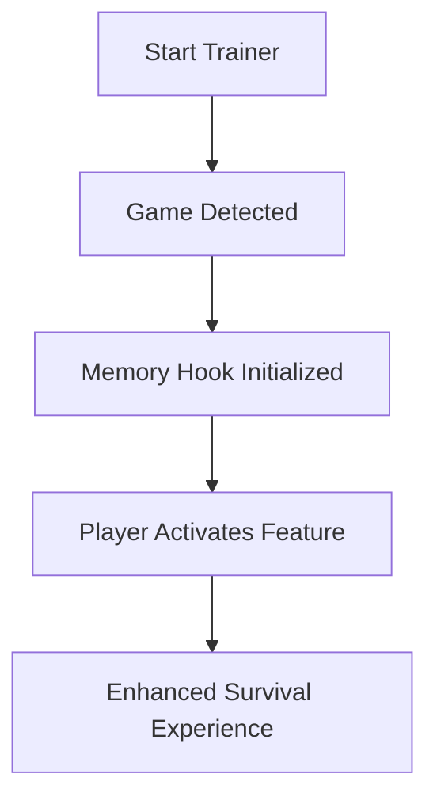

# 🧟 Dying Light: The Beast Trainer

Enter the undead city as more than a survivor — become the **Beast**. The **Dying Light: The Beast Trainer** is a next-gen gameplay enhancement tool designed for precision survival control. From god-tier combat endurance to infinite crafting and agility boosts, this trainer redefines what’s possible in Techland’s zombie world.

Whether you’re exploring rooftops or slashing through hordes at night, this tool gives you total control over stamina, health, loot, and parkour mastery — turning you into an unstoppable predator of the post-apocalypse.

---

## ⚙️ Overview

Built for **Windows 10/11**, this trainer supports all digital editions of *Dying Light: The Beast* — including **Steam**, **Epic Games**, and **Techland Launcher** releases. The tool runs on a safe overlay with memory-level toggles (no permanent injection or data corruption).

| Feature                | Description                                         | Hotkey |
| ---------------------- | --------------------------------------------------- | ------ |
| 💀 God Mode            | Invulnerable to all damage                          | F1     |
| ⚡ Infinite Stamina     | Unlimited sprint and combat energy                  | F2     |
| 🩸 Max Damage          | One-hit kills against all enemy types               | F3     |
| 🎒 Unlimited Inventory | Carry everything with zero weight                   | F4     |
| 🔦 UV Immunity         | Night Hunter and Volatile resistance                | F5     |
| 💰 Loot Multiplier x5  | Amplify drop rarity and quantity                    | F6     |
| 🧗 Parkour Mastery     | Perfect balance and jump control                    | F7     |
| 🧠 XP Multiplier       | Double XP across agility, power, and survivor ranks | F8     |

---

## 💪 Features

* **Survival Overdrive:** Toggle invulnerability, stamina, and UV shield in real-time.
* **Loot Radar Overlay:** ESP-style display highlighting lootable containers and rare materials.
* **Night Vision Injector:** Enhances low-light visibility for dark zones and tunnels.
* **Agility Calibration:** Adjust climb speed and landing momentum.
* **Blueprint Booster:** Unlocks every crafting recipe instantly.
* **Dynamic XP Curve:** Gain balanced progression without grind fatigue.

[!NOTE]
All features are non-destructive — disabling the trainer restores base gameplay instantly.

---

## 🧩 Compatibility Table

| Platform          | Support     |
| ----------------- | ----------- |
| Steam             | ✅ Full      |
| Epic Games        | ✅ Full      |
| Techland Launcher | ✅ Full      |
| Windows 10 / 11   | ✅ Supported |
| Controller Input  | ✅ Detected  |
| Linux (Proton)    | ⚠️ Partial  |

[!IMPORTANT]
Always **launch the trainer first**, then start the game to ensure stable memory hook detection.

---

## ⚡ Setup Guide

1. **Download & Extract**
   Move the `BeastTrainer` folder into your Dying Light installation directory.

2. **Run as Administrator**
   Open `BeastTrainer.exe` before launching the game.

3. **Launch Dying Light: The Beast**
   Wait for “🟢 Connected to Process” in the trainer console.

4. **Activate Features**
   Use the listed hotkeys or the overlay interface in-game.

```bash
# Example setup path
C:\Games\DyingLightTheBeast\
├── DyingLight.exe
├── BeastTrainer.exe
└── config.ini
```

---

## 🧬 Workflow Diagram



---

## 🧠 Advanced Modules

* **BioShock Reflex:** Auto-heal triggers when HP drops below 30%.
* **Predator Mode:** Highlights all enemies within 60m radius.
* **Dynamic Loot Sync:** Adapts drop rarity based on difficulty.
* **Flash Movement:** Boosts parkour motion blur for cinematic flow.
* **Crafting Chain:** Mass-craft selected items without delay.

[!WARNING]
Activating *Predator Mode* and *Loot Radar* simultaneously can affect framerate on older GPUs. Enable one at a time for optimal stability.

---

## ❓ FAQ

**Q1: Is the trainer safe to use in co-op?**
A: The trainer is designed for **offline/single-player** use. Online use is not recommended.

**Q2: Can I remap hotkeys?**
A: Yes. Open `config.ini` and assign your preferred keys.

**Q3: Does it affect achievements?**
A: Achievements remain fully functional when using offline mode.

**Q4: Will it break save files?**
A: No. The trainer doesn’t modify game data or persistent files.

**Q5: Is it updated for the latest patch?**
A: Yes. The trainer auto-detects version updates and adjusts its offsets dynamically.

---

## 🔥 Pro Survival Tips

* Combine **UV Immunity + Loot Multiplier** for perfect night farming runs.
* Use **XP Multiplier x2** to reach Legend ranks twice as fast.
* Toggle **Flash Movement** for cinematic parkour gameplay.
* Activate **Blueprint Booster** before scavenging runs to maximize efficiency.

[!TIP]
Run the game in **borderless fullscreen** for smoother overlay transitions.

---

## 🏁 Final Thoughts

The **Dying Light: The Beast Trainer** gives you mastery over survival, combat, and agility — reshaping how you experience Harran. Whether you’re climbing rooftops or battling in the dark, this trainer ensures you’re always in control, always the apex predator.

---

**Survive. Evolve. Dominate.**
*Activate The Beast Trainer and turn Harran into your hunting ground today.*
